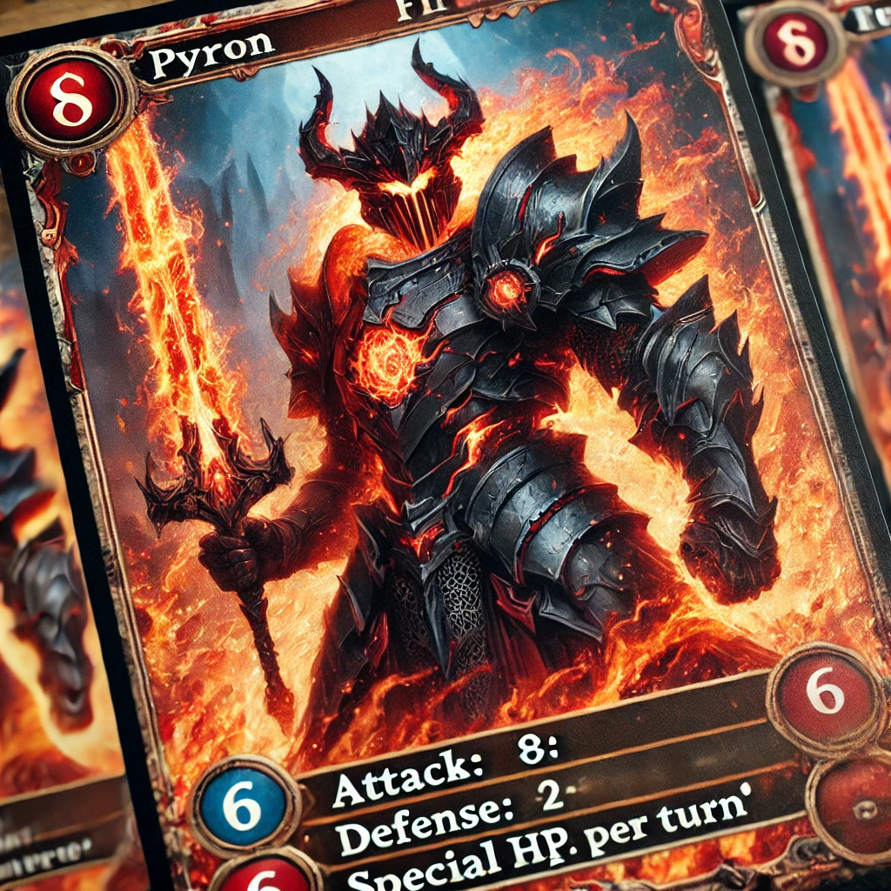

# 🃏 BaseLegend Mint

**Mint your exclusive on-chain NFT cards on Base network.**

> Pyron. Lightning Strike. Ancient Sword.  
> 3 cards. 3 powers. Only one mint per wallet.

---

## 🎮 Project Summary

BaseLegend is an on-chain card experience powered by Ethereum L2 (Base).  
Each card is minted as a fully on-chain NFT with unique metadata.

🛠 Built with:
- Solidity smart contract (ERC721)
- IPFS metadata via Pinata
- HTML + Ethers.js frontend
- Deployed on GitHub Pages

---

## 🖼️ Live Minting Page

👉 [**Click here to mint your card**](https://bentrnr21.github.io/baselegend-mint/)

---

## 📜 Smart Contract

- Address: [`0x440ae3c873dDa6120419dFa2F6Af6c097cbf1F4f`](https://basescan.org/address/0x440ae3c873dDa6120419dFa2F6Af6c097cbf1F4f)
- Network: Base Mainnet

---

## 🏛️ DAO Governance

BaseLegend is governed on-chain via a dedicated DAO built with [Nouns Builder](https://nouns.build).

- 🏰 DAO name: **BaseLegendsDAO**
- 🔗 DAO page: [`nouns.build/dao/base/0xaC2F9d8064DD0dDDA4199945A2e7fb9650B05135`](https://nouns.build/dao/base/0xaC2F9d8064DD0dDDA4199945A2e7fb9650B05135)
- 📦 Contracts deployed:
  - Token: `0xaC2F9d8064DD0dDDA4199945A2e7fb9650B05135`
  - Auction: `0x36E5a954253DDAa913d3054c023DA6B6C2A55397`
  - Treasury: `0xBddF7b5dEd7D70d0735ca9AAE26CB459aa0EB949`
  - Governor: `0xb8fFB2f756474d0311A818AOcde76d97E4B43521`
  - Metadata Renderer: `0xb0DD22317142d2878123C42316b8a184367895b7`

> DAO-based governance will be used to manage upgrades, future drops, and strategic gameplay updates.

---

## 🧠 Rules

- Each wallet can mint each card **once**
- Mint cost: **0.0005 ETH** per card
- Cards:
  - 🐉 **Pyron**
  - ⚡ **Lightning Strike**
  - 🗡️ **Ancient Sword**

---

## ✨ Screenshots

---

## 💙 Built on [Base](https://base.org)

---

## 📬 Contact

- Warpcast: [@bentrnr](https://warpcast.com/bentrnr)
- Twitter: [@Bentrnr21](https://x.com/Bentrnr21)
